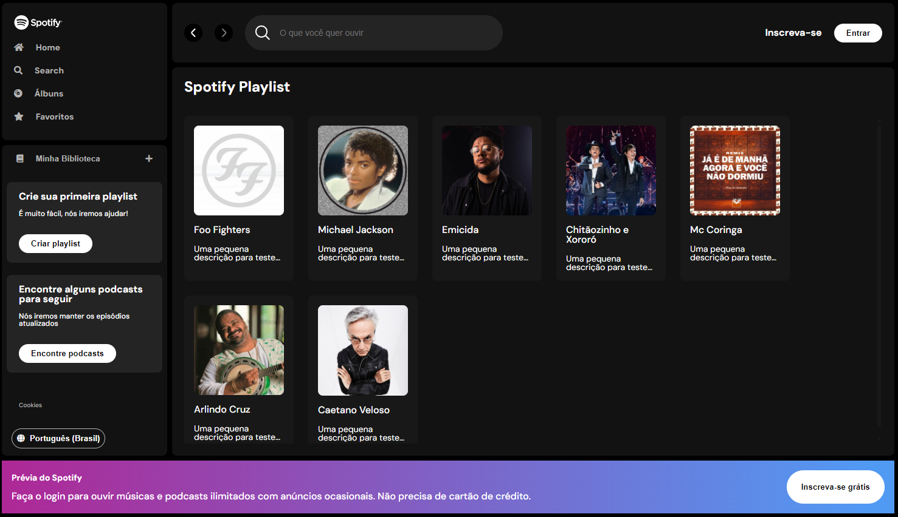

# Spotify Clone (React)

Este é um projeto inspirado no visual do Spotify, desenvolvido durante a Imersão Front-End da Alura.

## Preview

## Descrição

O projeto consiste em um clone do Spotify, utilizando React para componentizar a aplicação front-end. O objetivo é criar uma interface semelhante ao Spotify, onde é possível visualizar artistas e suas informações. Utilizei o [My Json Server](https://my-json-server.typicode.com/), permitindo que a aplicação continue realizando as requisições após o deploy, que foi feito na [netlify](https://www.netlify.com/).

## Funcionalidades

- Busca de artistas por nome
- Exibição dos artistas encontrados em formato de cards

## Tecnologias utilizadas

- React 
- React hooks
- Styled-components

## Link do projeto

[Clique aqui para visitar o projeto](https://imersao-dev-alura-spotify-react.netlify.app/)

## Como executar o projeto

1. Clone este repositório
2. Instale as dependências do projeto utilizando o comando `npm install`
3. Execute o json-server com o comando `npx json-server ./src/api/artists.json`
3. Execute o projeto com o comando `npm start`
4. Acesse o projeto no navegador através do endereço `http://localhost:3000`

## Autor

Felipe Diego Tamura

